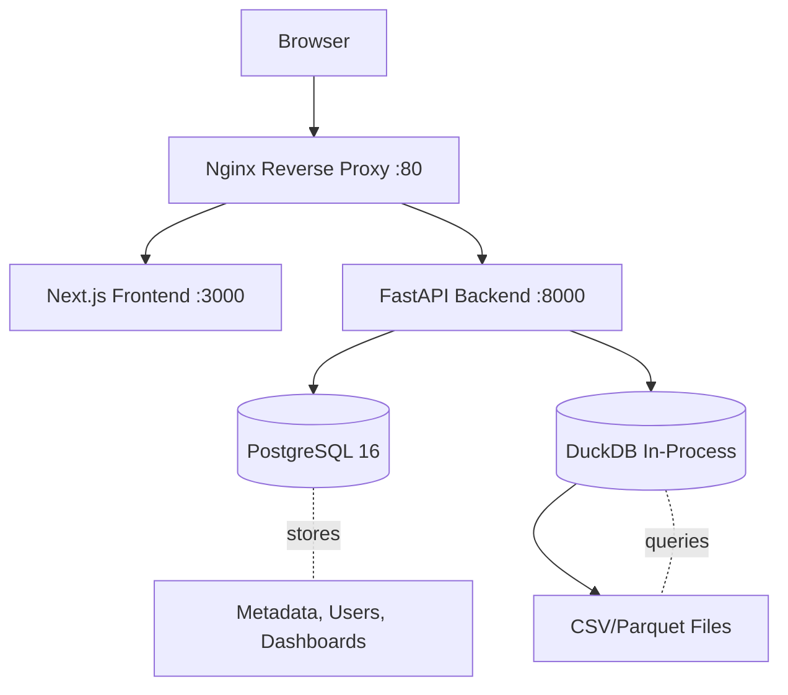

<div align="center">

# DataPilot

**Open-source conversational BI platform for SMBs**

    

</div>

---

## Overview

DataPilot is a modern Business Intelligence platform designed for small and medium-sized businesses (50-2000 employees). It combines the power of AI-driven natural language queries with traditional SQL exploration and visual dashboard building.

Built as a French sovereign alternative to tools like Looker, Metabase, and Omni Analytics, DataPilot prioritizes data sovereignty with OVH cloud hosting, multi-tenant isolation, and a CSV-first approach that eliminates the need for complex database connectors during early adoption.

The platform leverages Claude AI for text-to-SQL conversion, DuckDB for fast CSV/Parquet query execution, and a modern React frontend with drag-and-drop dashboard building capabilities.

## Features

**Implemented:**

- ✅ JWT Authentication with multi-tenant isolation (30min access + 7-day refresh)
- ✅ CSV Upload with automatic schema inference
- ✅ French CSV support (; delimiter + , decimal separator with auto-detection)
- ✅ SQL Explorer with CodeMirror 6 editor and TanStack Table results
- ✅ DuckDB-powered query execution on CSV/Parquet files
- ✅ Semantic model editor (visual ERD with ReactFlow for table joins)
- ✅ Dashboard builder with react-grid-layout (KPI, Bar, Line, Pie, Table widgets)
- ✅ SavedQuery CRUD (reusable queries)

**Roadmap:**

- 🔲 AI text-to-SQL with Claude API
- 🔲 PostgreSQL/MySQL database connectors
- 🔲 Spreadsheet view with visual aggregations
- 🔲 Global dashboard filters
- 🔲 Theme customization

<!-- Screenshot will be added soon -->

## Quick Start

**Prerequisites:**
- Docker & Docker Compose installed

**Steps:**

```bash
# 1. Clone the repository
git clone https://github.com/lucas-zubiarrain/DataPilot.git
cd DataPilot

# 2. Configure environment
cp .env.example .env
# Edit .env with your settings (JWT secret, database credentials, etc.)

# 3. Start all services
docker compose up -d

# 4. Run database migrations
docker compose exec backend alembic upgrade head

# 5. Access the platform
# Frontend: http://localhost:3000
# Backend API: http://localhost:8000/docs
```

**Default Admin Credentials (Development):**
- Email: `admin@datapilot.fr`
- Password: `admin`

## Development Setup

### Backend

```bash
cd backend

# Create virtual environment
python3.12 -m venv .venv
source .venv/bin/activate  # On Windows: .venv\Scripts\activate

# Install dependencies
pip install -r requirements.txt

# Run database migrations
alembic upgrade head

# Start development server
uvicorn app.main:app --reload --host 0.0.0.0 --port 8000

# Run tests
pytest tests/ -v
```

### Frontend

```bash
cd frontend

# Install dependencies
npm install

# Start development server
npm run dev

# Run tests
npm test
```

## Architecture



**Flow:**
1. User uploads CSV files via frontend
2. Backend converts CSV to Parquet (with French format detection)
3. User builds semantic model (ERD) to define table relationships
4. User explores data with SQL editor or builds dashboards
5. (Future) User asks questions in natural language → Claude API → SQL → Results

## Project Structure

```
DataPilot/
├── backend/
│   ├── app/
│   │   ├── core/            # Security, dependencies, settings
│   │   ├── models/          # SQLAlchemy ORM (User, DataSource, SemanticLayer, Dashboard, SavedQuery)
│   │   ├── schemas/         # Pydantic request/response validation
│   │   ├── routers/         # FastAPI endpoints (7 routers)
│   │   ├── services/        # Business logic (6 services)
│   │   └── migrations/      # Alembic database migrations
│   ├── tests/               # Pytest test suites (1469 lines)
│   ├── Dockerfile
│   └── requirements.txt
├── frontend/
│   ├── src/
│   │   ├── app/             # Next.js App Router (10 pages)
│   │   ├── components/
│   │   │   ├── ui/          # shadcn/ui components (16 components)
│   │   │   └── features/    # Business components (Explorer, Dashboard, ERD)
│   │   ├── contexts/        # React contexts (AuthContext)
│   │   └── lib/             # API client, utilities
│   ├── Dockerfile
│   └── package.json
├── nginx/                   # Reverse proxy configuration
├── docs/                    # API documentation + technical specs
├── docker-compose.yml       # Development environment
├── docker-compose.prod.yml  # Production environment
├── CLAUDE.md                # AI context and project documentation
└── .env.example             # Environment variables template
```

## Tech Stack

| Component | Library | Why |
|-----------|---------|-----|
| **Backend Framework** | FastAPI | High performance, auto-generated OpenAPI docs, async support |
| **ORM** | SQLAlchemy 2.0 | Industry standard, excellent async support, type-safe |
| **Migrations** | Alembic | Standard for SQLAlchemy, version control for database schema |
| **Database** | PostgreSQL 16 | Robust, multi-tenant ready, JSON support |
| **Query Engine** | DuckDB | In-process analytical database, native CSV/Parquet support, cross-file JOINs |
| **Frontend Framework** | Next.js 15 | React-based, App Router, server components, excellent DX |
| **UI Components** | shadcn/ui | Accessible, customizable, Tailwind-based components |
| **SQL Editor** | CodeMirror 6 | Modern, lightweight (~400KB vs Monaco's 5MB), SQL highlighting |
| **Data Tables** | TanStack Table | Headless, MIT license, ~50KB, perfect for SQL results |
| **ERD Editor** | ReactFlow | React-native nodes/edges, ~180KB, visual relationship mapping |
| **Dashboard Grid** | react-grid-layout | Industry standard (used by Grafana), drag+resize |
| **Charts** | Recharts | 5 chart types (KPI, Bar, Line, Pie, Table), React-native |
| **File Upload** | react-dropzone | Multi-file support, lightweight, great UX |
| **Authentication** | python-jose + passlib | JWT tokens, bcrypt hashing, secure by default |
| **AI Provider** | Claude API | Best-in-class text-to-SQL capabilities |
| **Infrastructure** | Docker Compose | Easy local development, production-ready |

## API Reference

**Base URL:** `/api/v1/`

| Endpoint | Description | Documentation |
|----------|-------------|---------------|
| `/auth` | Authentication (register, login, refresh, me) | [docs/api/auth.md](docs/api/auth.md) |
| `/data-sources` | CSV upload, list, preview, delete | [docs/api/data-sources.md](docs/api/data-sources.md) |
| `/workspaces` | Workspace CRUD | [docs/api/workspaces.md](docs/api/workspaces.md) |
| `/semantic-layers` | Semantic model (ERD) CRUD | [docs/api/semantic-layers.md](docs/api/semantic-layers.md) |
| `/queries` | Execute SQL, manage saved queries | [docs/api/queries.md](docs/api/queries.md) |
| `/dashboards` | Dashboard and widget CRUD | [docs/api/dashboards.md](docs/api/dashboards.md) |
| `/ai` | Text-to-SQL conversion (planned) | Coming soon |

Full API documentation available at `http://localhost:8000/docs` (Swagger UI) when running locally.

## Tests

**Backend:**
- Framework: pytest
- Coverage: 1469 lines across 5 test suites
- Suites: auth, csv_upload, queries, semantic_layers, tenant_isolation

**Frontend:**
- Framework: Jest + React Testing Library
- Coverage: 15 tests (login, register, middleware)

Run tests:
```bash
# Backend
docker compose exec backend pytest tests/ -v

# Frontend
cd frontend && npm test
```

## Contributing

We welcome contributions! Please see [CONTRIBUTING.md](CONTRIBUTING.md) for guidelines on:
- Code of conduct
- Development workflow
- Pull request process
- Commit message conventions (Conventional Commits)

**Quick tips:**
- Always work on feature branches (never on `main`)
- Run linters before committing
- Write tests for new features
- Keep PRs focused and scoped

## Security

Please review our [SECURITY.md](SECURITY.md) for:
- Reporting security vulnerabilities
- Security best practices
- Multi-tenant isolation guarantees

**Critical rule:** All database queries MUST filter by `tenant_id`. No exceptions.

## License

DataPilot is licensed under the Apache License 2.0. See [LICENSE](LICENSE) for details.

Copyright 2026 DataPilot contributors.

## Acknowledgments

DataPilot is built on the shoulders of giants:

- [FastAPI](https://fastapi.tiangolo.com/) - Modern Python web framework
- [Next.js](https://nextjs.org/) - React framework for production
- [DuckDB](https://duckdb.org/) - In-process analytical database
- [shadcn/ui](https://ui.shadcn.com/) - Beautiful UI components
- [ReactFlow](https://reactflow.dev/) - Visual node editor
- [TanStack Table](https://tanstack.com/table) - Headless table library
- [CodeMirror](https://codemirror.net/) - Code editor component
- [Recharts](https://recharts.org/) - Composable charting library

---

<div align="center">

**[Documentation](docs/) • [API Reference](docs/api/) • [Roadmap](BACKLOG.md) • [Contributing](CONTRIBUTING.md)**

</div>
